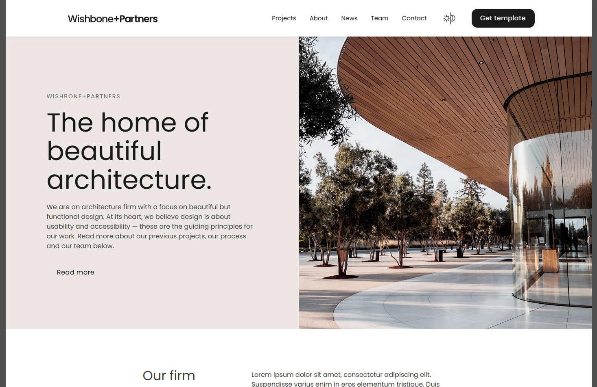
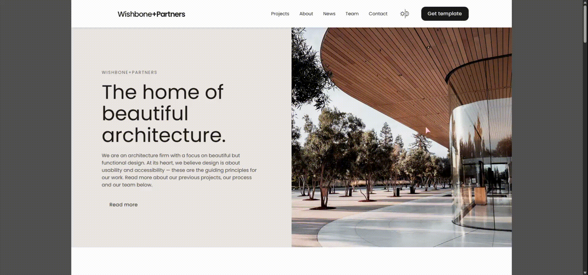

# Wishbone+Partners Landing Page

[Live Demo](https://your-vercel-url.vercel.app) 🌐

---


## О проекте
Этот лендинг был изначально сверстан на **HTML и CSS**, а затем полностью переписан на **React + TypeScript + Vite** с современной компонентной архитектурой.  

Проект демонстрирует:

- Чистую структуру компонентов и секций
- Темную и светлую тему с переключением
- Плавные анимации секций при прокрутке (scroll reveal)

Это отличный пример моего роста как фронтенд-разработчика — от статичной верстки к современному React-проекту.


## Стек технологий
- **React 18** — компоненты и хуки  
- **TypeScript** — строгая типизация и интерфейсы  
- **Vite** — быстрый dev сервер и сборка  
- **CSS Modules** — scoped стили для компонентов  
- **IntersectionObserver** — плавные scroll reveal анимации  
- **Vercel** — деплой и хостинг проекта


## Основные фичи
- Темная / светлая тема с toggle  

- Анимация появления секций при скролле  

- Модульные компоненты (`sections/`, `components/`)  
- Декоративные SVG и иконки с поддержкой цвета через CSS  
- Карточки проектов и команды с переиспользуемой логикой  
- Чистая архитектура, готовая к расширению


## Выводы
- Создала адаптивный и кроссбраузерный лендинг по дизайн-макету.  
- Применяла **modern CSS**, **Grid**, **Flexbox**, CSS Modules для организации стилей.  
- Развила навыки адаптивной верстки и кроссбраузерного тестирования.  
- Практиковала **Git и GitHub**, контроль версий и работу с ветками.  


## Структура проекта

```txt
src
 ├─ assets        # изображения, SVG и декорации
 ├─ components    # переиспользуемые UI-компоненты (Button, Cards, Header, Footer)
 ├─ data          # данные для презентации
 ├─ pages         # если будут отдельные страницы
 ├─ sections      # смысловые блоки лендинга (Cover, HowWeDo, PhotoSection...)
 ├─ styles        # глобальные CSS-модули
 ├─ types         # TypeScript типы для компонентов и данных
 ├─ utils         # хуки и вспомогательные функции
 └─ main.tsx      # точка входа проекта
```

## Запуск
```txt
npm install
npm run dev
```

## Репозиторий
[Wishbone+Partners](https://github.com/AlekSidorova/Wishbone_2.0)

## Контакты
Если есть вопросы, свяжитесь со мной: **Александра Сидорова**  
Email: mehaleka240399@yandex.com

---

Проект создан в рамках развития портфолио и демонстрирует подход к архитектуре, стилям и анимациям в современных React-приложениях.
